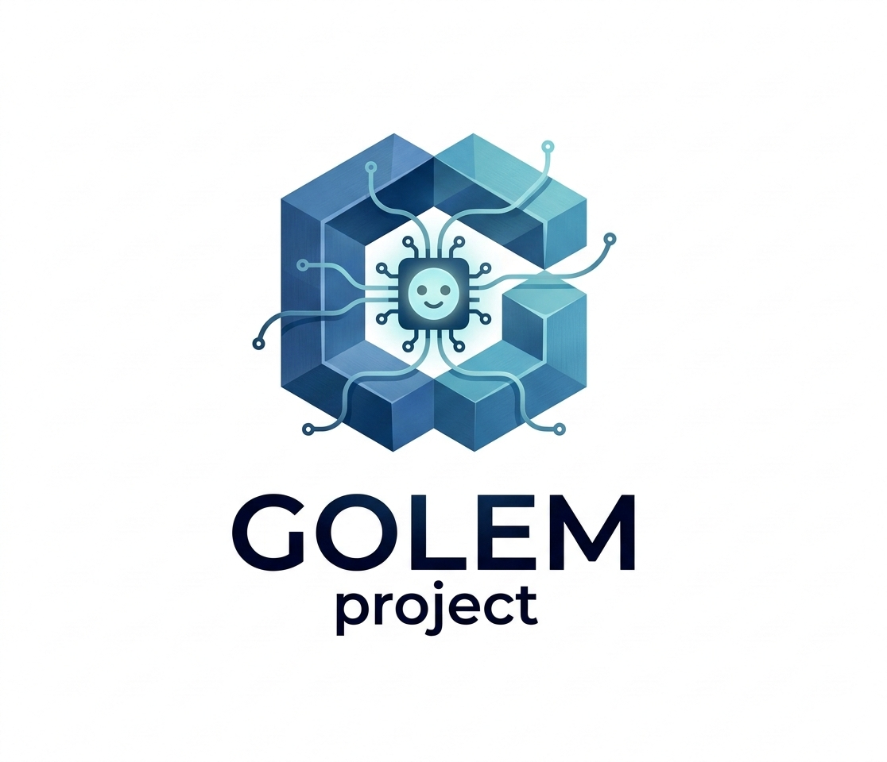
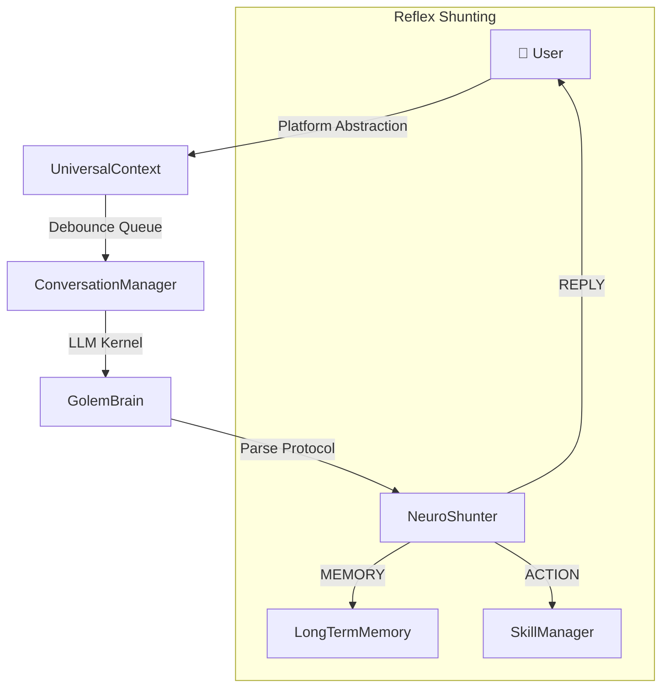

<div align="center">

# 🤖 Project Golem v9.1
> **Ultimate Chronos + MultiAgent + Social Node Edition**



### Autonomous AI Agent System with Long-term Memory, Free Will, and Cross-platform Capabilities

<p>
  
  
  
  
  
</p>

[Capabilities](#-core-capabilities) · [Architecture](#-system-architecture) · [Memory System](#-pyramidal-long-term-memory) · [Quick Start](#-quick-start) · [Usage](#-command-reference) · [Contributing](CONTRIBUTING.md)

<br/>

[繁體中文](README.md) | **English**

</div>

---

## ✨ What is this?

**Project Golem** is not just another chatbot.

It is an autonomous AI agent that uses **Web Gemini's infinite context** as its brain and **Puppeteer** as its hands. It can:

- 🧠 **Remember You** — Pyramidal 5-tier memory compression, capable of preserving **50 years** of conversational essence.
- 🤖 **Act Autonomously** — Browses news, introspects, and sends messages to you spontaneously when you are away.
- 🎭 **Summon AI Teams** — Generates multiple AI experts for roundtable discussions to produce consensus summaries.
- 🔧 **Self-Healing** — Features "DOM Doctor" to automatically repair tasks after Google updates its UI.
- 📚 **Self-Learning** — Use the `/learn` command to have Golem write new skill modules for itself using its own computing power.

> **Browser-in-the-Loop Architecture**: Golem doesn't rely on restrictive official APIs. It directly controls a browser to use Web Gemini, enjoying the advantages of an "infinite context window" and intuitive operations.

---

## 🚀 Core Capabilities

| 🧠 Long-term Memory | 🎭 Interactive MultiAgent | ⏰ Titan Chronos |
| :--- | :--- | :--- |
| From hourly logs to epoch milestones, 50 years of memory takes only ~3MB. | Summon tech teams or debate groups with one click for collaborative consensus. | Natural language scheduling for automated reminders and periodic task execution. |

| 🛡️ Self-Defense | 🔧 Skill Capsules | 🖥️ Web Dashboard |
| :--- | :--- | :--- |
| Securely intercepts high-risk commands with an automated Selector repair engine. | Hot-reloadable skills that can be packaged and shared across instances. | Intuitive Next.js interface for monitoring and real-time terminal interaction. |

---

## 🏗️ System Architecture

Golem employs a **Browser-in-the-Loop** hybrid architecture:



### Key Components

| Component | Description |
|------|------|
| `GolemBrain` | Core engine encapsulating Puppeteer to control Web Gemini. |
| `UniversalContext` | Abstraction layer unifying multiple platforms (Telegram/Discord). |
| `NeuroShunter` | Parses structured AI responses to execute memory, actions, or replies. |
| `AutonomyManager` | Handles spontaneous behaviors (introspection, autonomous posting, news broadcasting). |
| `SkillManager` | Manages dynamically loaded skill modules (Skills). |

---

## 🧠 Pyramidal Long-term Memory

This is Golem's most unique technical capability, ensuring memory is never lost through multi-tier compression:

1. **Tier 0**: Hourly raw conversation logs.
2. **Tier 1 (Daily)**: Daily summaries (~1,500 words).
3. **Tier 2 (Monthly)**: Monthly highlights.
4. **Tier 3 (Yearly)**: Yearly reviews.
5. **Tier 4 (Epoch)**: Epoch milestones.

**50-Year Storage Comparison:**
* **Legacy (No Compression)**: ~18,250 files / 500 MB+
* **Golem Pyramid**: **~277 files / 3 MB**

---

## ⚡ Quick Start

### Prerequisites
- **Node.js** v20+
- **Google Chrome** (Required for Puppeteer)
- **Telegram Bot Token** (Get from [@BotFather](https://t.me/BotFather))

### Installation & Startup

**⚡ Recommended: One-Click Magic Installation**
Double-click `Start-Golem.command` (Mac/Linux) or `setup.bat` (Windows) in the project directory.

**🔨 Manual Operation (Terminal)**
```bash
# Grant execution permissions
chmod +x setup.sh

# Fully automated installation
./setup.sh --magic

# Start directly
./setup.sh --start
```

---

## 🎮 Command Reference

| Command | Function |
|------|------|
| `/help` | View full command descriptions |
| `/new` | Reset conversation and load relevant memory |
| `/learn <feature>` | Have the AI automatically learn and generate a new skill |
| `/skills` | List all installed skills |

---

## 📂 Project Structure

- [🛠️ Contributing Guide](CONTRIBUTING.md)
- [🖥️ Web Dashboard Guide](docs/Web-Dashboard-使用說明.md)

---

## 📈 Star History

[](https://star-history.com/#Arvincreator/project-golem&Date)

---

## ⚠️ Disclaimer

1. **Security Risk**: Do not grant root/admin permissions in production environments.
2. **Privacy Note**: the `golem_memory/` folder contains Session Cookies; please keep it secure.
3. Users assume all risks associated with operations; developers assume no legal liability.

---

<div align="center">

**Developed with ❤️ by Arvincreator & @sz9751210**

</div>
