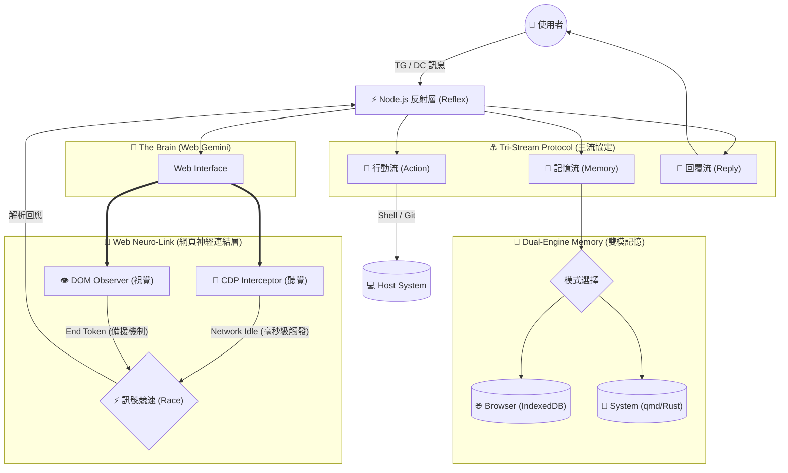

<a href="https://www.buymeacoffee.com/arvincreator" target="_blank"></a>

# 🦞 Project Golem v8.5 (Titan Edition)
---------------------------------------------------
 * 架構：[Universal Context] -> [Node.js 反射層 + 雙模記憶引擎] <==> [Web Gemini 主大腦]
 * 核心升級：
 * 1. 🛡️ Titan Protocol: 採用純英文大寫標籤 ([GOLEM_ACTION])，移除 Emoji 降低解析干擾。
 * 2. 🥪 Envelope Lock: 實作「三明治信封」鎖定機制 ([[BEGIN]]...[[END]])，徹底解決非同步競態與截斷問題。
 * 3. ⚡ Robust Parser: 寬鬆格式解析器，支援斷尾 JSON 修復與模糊匹配。
 * ---------------------------------------------------
 * 原有特性保留：
 * 🐍 Hydra Link | 🧠 Tri-Brain | 🛡️ High Availability | ☁️ OTA Upgrader
 * 💰 Sponsor Core | 👁️ Agentic Grazer | 🔍 Auto-Discovery | 🔮 OpticNerve
 * 🌗 Dual-Engine Memory | ⚡ Neuro-Link (CDP Integration)
 */

> **"I perceive, therefore I act."**
> **搭載「網頁神經連結 (Web Neuro-Link)」技術的自律型 AI 代理人。**
> **結合 CDP 網路直連、雙模記憶引擎與全自動 Git 版控，實現 99% 穩定性的 Web 自動化操作。**

Project Golem 是一個基於 Puppeteer 控制 Web Gemini 的本機 AI Agent。
**v8.5 版本** 引入了 **Web Neuro-Link 架構**，透過直接監聽瀏覽器底層網路訊號，徹底解決了傳統網頁自動化「卡住」或「反應遲鈍」的痛點，並整合了戰術控制台 (Dashboard) 實現視覺化監控。

---

## 🏗️ 系統架構深度解析 (System Architecture)

Golem v8.5 的核心在於 **Web Neuro-Link (網頁神經連結層)**。它不再依賴單一的視覺辨識，而是同時運用「視覺 (DOM)」與「聽覺 (Network)」來感知世界，確保在大腦思考與行動之間的零延遲傳輸。



---

## 📊 戰術控制台 (Tactical Dashboard) `NEW`

v8.5 內建駭客風格的終端機儀表板，即時視覺化 **Web Neuro-Link** 的運作狀態。

```text
┌─ ⚡ System Load (CPU/RAM) ──────────┐┌─ 🧠 Engine Status ──────────┐
│ CPU: [||||||       ] 12%           ││ Mode: Browser (Vector)      │
│ RAM: [||||||||||   ] 145 MB        ││ Link: 🟢 Web Neuro-Link     │
└────────────────────────────────────┘└─────────────────────────────┘
┌─ 📠 Web Neuro-Link Logs (Real-time Network/DOM Signals) ──────────┐
│ [10:23:41] ⚡ [Brain] 啟動雙軌監聽 (Dual-Track)...                │
│ [10:23:42] 📡 [CDP] 鎖定神經訊號: req_batchexecute_8392           │
│ [10:23:43] 👁️ [DOM] 偵測到文字輸出 (視覺確認)...                  │
│ [10:23:44] ✅ [CDP] 網路傳輸完畢 (Winner: Network)                │
│ [10:23:45] 💬 [回覆] 專案 git-demo 初始化完成，已推送到 GitHub。  │
└───────────────────────────────────────────────────────────────────┘
┌─ 💬 Tri-Stream Protocol ──────────────────────────────────────────┐
│ [記憶] 已寫入: "使用者偏好使用 TypeScript 開發"                   │
│ [行動] 執行指令: git push -u origin master                        │
└───────────────────────────────────────────────────────────────────┘

```

---

## 🚀 v8.5 核心功能 (Core Features)

### ⚡ Web Neuro-Link (網頁神經連結) `核心`

* **雙軌並行監聽**：Golem 不再只是傻傻地「看」網頁，而是直接「聽」瀏覽器的網路脈衝。它同時監聽 CDP Network 封包與 DOM 變化。
* **極速反應**：Gemini 伺服器傳輸結束的毫秒級瞬間，Golem 立即觸發行動，不再依賴死板的 `sleep` 輪詢。
* **高強韌性**：即使網頁渲染卡頓、CSS Class 改變，只要底層網路訊號確認完成，系統依然能正常運作。

### 🐙 Git Master (版本控制大師) `v8.5 NEW`

* **全自動版控**：Golem 能自主執行 `git init`, `add`, `commit`, `push` 等操作。

* **環境感知**：操作前自動檢查 `.gitignore` 與 Remote 狀態，避免發生災難性覆蓋。

### 🌗 Dual-Engine Memory (雙模記憶引擎)

* **策略模式**：支援「瀏覽器內建向量庫 (Transformers.js)」與「系統級 Rust 檢索 (qmd)」兩種模式。
* **RAG 技術**：結合 Hybrid Search (關鍵字+向量) 與 Rerank 重排序技術，讓 AI 擁有過目不忘的長期記憶。

### 👁️ OpticNerve (視神經)

* **多模態視覺**：整合 **Gemini 2.5 Flash** API。直接將圖片、PDF 文件傳給 Golem，它能進行深度解析、代碼除錯、UI 結構分析，甚至讀懂梗圖。

### ⚓ Tri-Stream Protocol (三流協定)

* **多工處理**：將單次思考拆解為「記憶寫入」、「外部行動」、「對話回覆」三條平行串流。Golem 能在聊天的同時，默默將重要資訊寫入筆記，並在背景執行 Shell 指令。

### 🔍 Auto-Discovery (自動探測)

* **環境適應**：在執行 Python、Node.js 或 FFmpeg 指令前，主動探測宿主機環境。如果工具未安裝，它會提出警告而非盲目報錯。

---

## ⚡ 快速部署 (Quick Deployment)

我們提供了一鍵安裝腳本，自動完成環境檢測、依賴安裝與記憶模式設定。

### 1. 獲取 Token

* **Gemini API Key** (必備): [Google AI Studio](https://aistudio.google.com/app/apikey)
* **Telegram token (必填）  / Discord Token** (選填)

### 2. 下載專案

```bash
git clone https://github.com/Arvincreator/project-golem.git
cd project-golem

```

### 3. 一鍵安裝 (自動化)

此腳本會自動安裝 Node.js (若無)、`blessed` 儀表板套件，並建立 `.env` 設定檔。

* **Mac / Linux**:
```bash
chmod +x setup.sh
./setup.sh

```


* **Windows**:
直接雙擊執行 `setup.bat` 即可。

### 4. 啟動 Golem

* **標準模式** (背景執行):
```bash
npm start

```


* **戰術控制台模式** (推薦，含視覺化儀表板):
```bash
npm start dashboard

```


*(按 `F12` 可將介面分離 Detach，讓程式繼續在背景運作)*

---

## 📖 生活化情境展示

### 1. 軟體開發 (Git Ops)

> **User**: "幫我開一個新專案 `my-app`，然後推送到 GitHub。"
> **Golem**: *(自動執行 `mkdir`, `git init`, `git remote add`)*
> "專案 `my-app` 初始化完成！已為您設定好 Remote Origin，並完成了第一次 Commit。需要我順便產生 `.gitignore` 嗎？"

### 2. 視覺除錯 (OpticNerve)

*(使用者上傳一張 Server 報錯的截圖)*

> **Golem**: *(透過 Gemini 2.5 Flash 分析截圖中的 Error Log)*
> "偵測到 `EADDRINUSE: port 3000` 錯誤。這表示 Port 3000 被佔用了。
> 我可以執行 `lsof -i :3000` 幫你找出是哪個 Process 佔用，或者直接幫你殺掉它嗎？"

---

## ⚠️ 免責聲明 (Disclaimer)

1. **自行承擔風險**：本軟體擁有執行 Shell 指令的高級權限，請謹慎授權高風險操作（如 `rm`, `Format`）。
2. **帳號安全**：建議使用 **分身 Google 帳號 (Burner Account)** 來運行 Golem，以避免因自動化操作導致主帳號風險。
3. **隱私聲明**：所有的長期記憶與向量資料皆儲存於您的 **本機設備**，開發者無法存取。

---

Created with Gemini by **Arvin_Chen**
<a href="https://www.buymeacoffee.com/arvincreator" target="_blank"></a>
