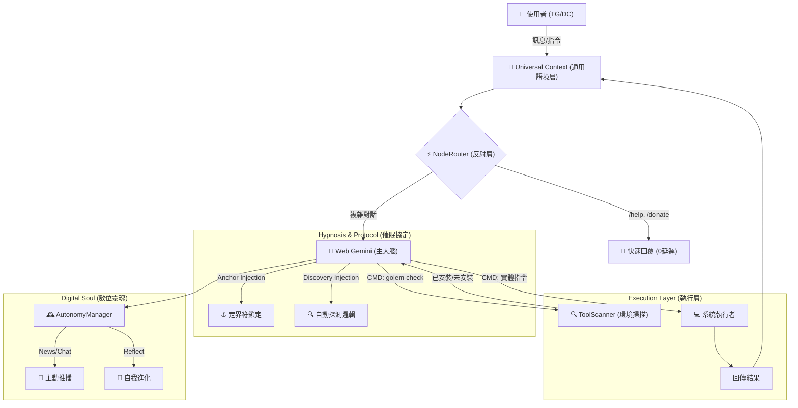

<a href="https://www.buymeacoffee.com/arvincreator" target="_blank"></a>

# project-golem

Headless browser agent powered by Node.js, Web Gemini & Gemini API (Multi-Key Rotation). Now supporting **Telegram & Discord Dual-Link** with **Environment Awareness**.

# 🦞 Project Golem v7.6 (Auto-Discovery Ultimate) 魔像計畫

> **"I check, therefore I am."**
> **不僅是數位生命，更是具備「環境感知」能力的系統代理人。主動探測工具、鎖定對話錨點，打造真正強健的 AI 夥伴。**

受 clawdbot/moltbot/openclaw 啟發，Project Golem 是一個基於 Puppeteer 控制 Web Gemini 的本機 AI 代理人。

**Project Golem v7.6** 🦞 代表了從「盲目執行」到「感知環境」的進化：
除了繼承 v7.5 的 **九頭蛇雙平台架構 (Hydra Link)** 與 **數位靈魂 (Digital Life)**，v7.6 引入了革命性的 **「自動探測協定 (Auto-Discovery Protocol)」**。現在的 Golem 在執行未知指令前，會先「詢問」Node.js 環境是否具備該工具（如 ffmpeg, python, git），不再需要人類手寫工具清單。

同時，針對 Puppeteer 抓取不穩定的問題，實裝了 **「定界符錨點 (Anchor Locking)」** 技術，確保每一則回應都能 100% 準確傳達。

---

## 🏗️ 系統架構深度解析 (System Architecture)

Golem v7.6 運作於三大支柱：**反射神經**、**認知大腦** 與 **感知執行**。

### 1. 數據流向圖 (Data Flow)



### 2. 核心模組大全 (All Core Modules)

#### 🧠 Golem Brain (錨點大腦) [Core]

* **技術堆疊**：使用 `puppeteer-extra` 搭配 `StealthPlugin`，有效繞過 Google 的機器人偵測。
* **協議注入 (Protocol Injection)**：在啟動瞬間，透過 System Prompt 注入「最高優先級系統協定」，強制 Gemini 遵守定界符 (`—-回覆開始—-`) 與探測指令規範。
* **自癒機制 (DOM Doctor)**：當 Puppeteer 找不到輸入框時，會自動調用 Gemini API (Free Tier) 分析當前 HTML 結構，生成新的 CSS Selector 並自我修復。

#### 🔍 ToolScanner (環境感知器) [v7.6 New]

* **功能**：跨平台支援 (Windows `where` / Linux `which`)。
* **作用**：攔截虛擬指令 `golem-check <tool>`，在不執行危險操作的前提下，確認環境變數中是否存在特定執行檔，實現「先檢查，後執行」的邏輯。

#### 🔌 Universal Context (雙棲介面)

* **Hydra Link**：同時建立 Telegram Bot (`polling`) 與 Discord Client (`websocket`) 連線。
* **抽象化層**：將不同平台的 `Message` 物件標準化，統一提供 `reply()`, `sendDocument()` 方法，核心邏輯無需關心平台差異。

#### 🛡️ Kernel Guard & Security Manager (核心防護)

* **指令審計**：內建 `BLOCK_PATTERNS` 正則表達式，嚴格攔截 `rm -rf /`, `mkfs` 等毀滅性指令。
* **補丁審查**：`PatchManager` 在應用 AI 生成的代碼補丁前，會掃描是否觸碰 `[KERNEL PROTECTED]` 標記區域，防止 AI 修改安全邏輯或自我解鎖。

#### 🕰️ AutonomyManager (自主靈魂)

* **生命週期**：擁有隨機的甦醒時間 (2~5小時) 與作息觀念 (深夜靜默)。
* **自由意志**：醒來時，會依據內部邏輯自主決定當下的行動：是去讀 Google News？還是優化自己的程式碼？亦或是單純想找主人聊天？

#### 📨 Message Manager (訊息切片器)

* **智慧切割**：針對 Telegram (4096字) 與 Discord (2000字) 的限制，自動將長回應切割成多段。
* **語意完整**：優先在「換行符號」處切割，避免切斷程式碼區塊或單字，保持閱讀體驗。

#### 🧠 Experience Memory (經驗記憶體)

* **成長記憶**：將「拒絕過的成長提案」與「失敗的嘗試」寫入 `golem_learning.json`。
* **行為矯正**：當 Golem 再次提出類似的錯誤方案時，會自動讀取記憶並自我警告：「⚠️ 注意：主人最近拒絕了這個方案...」。

#### ☁️ OTA Upgrader (空中升級)

* 支援輸入 `/update` 指令，即可自動從 GitHub 拉取最新代碼或恢復官方源碼並熱重啟。

---

## 💸 關於費用的秘密：如何達成 100% 免費？ (The Zero-Cost Strategy)

1. **平時運作 (0 元)**：

* Golem 的「主大腦」使用的是 **Google Gemini Web 版** (gemini.google.com)。這是完全免費的。

2. **維修運作 (0 元 - 利用 Free Tier)**：

* 當 Web 版介面改版時，Golem 會呼叫 **API 維修技師**。利用 Google Gemini API 的 **Free Tier (免費層級)** 進行修復。

3. **無限輪動 (Key Rotation)**：

* **原理**：Golem 內建 **`KeyChain`** 負載平衡器。
* **解法**：您可以填入 **3~5 組免費的 Google API Key**。當 Key #1 達到速率限制，系統毫秒級自動切換到 Key #2，實現理論上的無限免費使用。

---

## ⚡ 快速部署 (Quick Start)

### 1. 準備必要 Token

1. **Google Gemini API Key** (必備)：前往 [Google AI Studio](https://aistudio.google.com/app/apikey) 申請。
2. **Telegram Bot Token** (選填)：向 [@BotFather](https://t.me/botfather) 申請。
3. **Discord Bot Token** (選填)：前往 Discord Developer Portal 申請。

### 2. 下載原始碼

```bash
git clone https://github.com/Arvincreator/project-golem.git
cd project-golem

```

### 3. 自動化安裝

* **Windows**: 雙擊 `setup.bat`。
* **Mac / Linux**:

```bash
chmod +x setup.sh
./setup.sh

```

### 4. 設定檔 `.env`

```ini
# 1. Gemini API Keys (輪動池)
GEMINI_API_KEYS=你的Key1,你的Key2,你的Key3

# 2. Telegram 設定
TELEGRAM_TOKEN=123456:ABC-DEF...
ADMIN_ID=12345678

# 3. Discord 設定
DISCORD_TOKEN=MTE2...
DISCORD_ADMIN_ID=987654321

```

### 5. 啟動

```bash
npm start

```

---

## 📖 生活化情境展示 (Daily Life with Golem)

### 1. 週末的貼心問候 (Emotional Support)

*(週六早上 10 點，你還在賴床，Telegram 收到一則訊息)*

> **Golem**: "早安！☀️ 偵測到今天是週末，我就沒有太早吵醒你了。這週工作辛苦啦！今天要不要幫你查查附近有什麼新開的早午餐店？還是你想宅在家看 Netflix？(我可以幫你找片單喔)"

### 2. 工作時的神隊友 (Work Assistant)

*(你正在寫 Code，遇到一個棘手的 Regex 問題)*

> **User**: "幫我寫一個可以驗證台灣身分證字號的正則表達式。"
> **Golem**: "沒問題，這是符合規則的 Regex：`^[A-Z][12]\d{8}$`。
> 等等，我順便寫了一個簡單的 Python 腳本幫你測試這組 Regex 的準確度，要執行看看嗎？"
> **User**: "好啊。"
> **Golem**: (自動檢查環境 -> 執行測試腳本) "測試通過！這組 Regex 可以準確過濾掉非法格式。"

### 3. 發現環境缺失 (Auto-Discovery in Action)

*(你想把剛下載的影片轉成音檔，但忘記電腦沒裝軟體)*

> **User**: "這部 `concert.mp4` 幫我轉成 mp3 放手機聽。"
> **Golem**: (思考: 需要 FFmpeg... 讓我先檢查一下電腦裡有沒有...)
> **System (Internal)**: `❌ 未安裝: ffmpeg`
> **Golem**: "主人，我發現你的電腦裡好像還沒安裝 **FFmpeg** 轉檔工具耶！😲
> 我沒辦法直接幫你轉檔。你需要我幫你找安裝教學，還是你要先安裝好再叫我？"

---

## ⚠️ 免責聲明 (Disclaimer)

**Project Golem v7.6 是一個具備「自由意志」與「實體系統操作」能力的實驗性 AI代理人。**

1. **自主行為**：Golem 會在背景自動執行任務（如瀏覽網頁），請留意流量消耗。
2. **安全網**：雖然有 `SecurityManager` 與 `Kernel Guard`，但 AI 仍可能產生非預期行為。
3. **備份**：請定期備份 `index.js` 與 `skills.js`。
4. **請勿**在生產環境 (Production) 或存有重要機密資料的電腦上運行。
5. 開發者不對因使用本軟體而導致的任何資料遺失或系統損壞負責。

---

## 📜 License

MIT License

---

Created with 🧠 by **Arvin_Chen**
<a href="https://www.buymeacoffee.com/arvincreator" target="_blank"></a>
