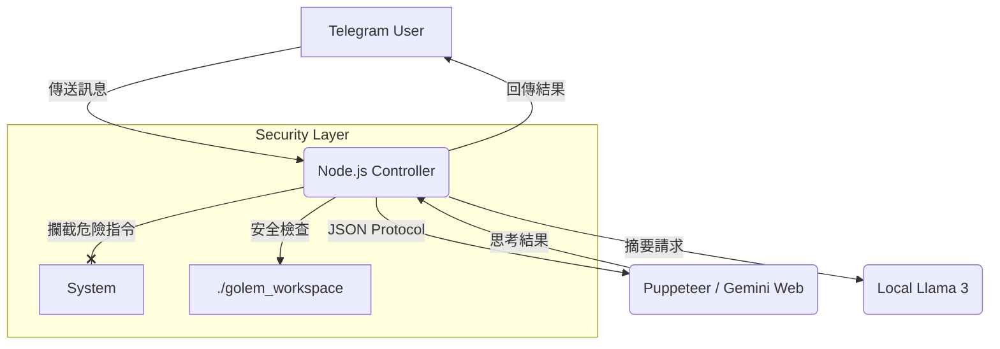

# project-golem
Headless browser agent powered by Gemini &amp; Ollama.

---

### 📋 建議操作

1. 在專案根目錄建立一個 `README.md` 檔案。
2. 將以下內容複製貼上。
3. (選用) 如果你有截圖，將圖片放入 `screenshots/` 資料夾並修改連結。

---

```markdown
# 🦞 Project Golem (魔像計畫)

  

> **一個基於 Puppeteer 與 Gemini 的「瀏覽器自動化」AI 代理人。**
> 無需 API Key，直接賦予 Telegram 機器人操作電腦與聯網思考的能力，並具備企業級的沙盒安全機制。

---

## 📖 關於專案 (About)

**Project Golem** 是一個實驗性的 AI Agent 系統。與傳統調用 API 的機器人不同，Golem 透過 **Puppeteer** 直接模擬真人操作 Google Gemini 網頁版，實現了「零成本」的無限長文本對話與邏輯推理。

在 **v3.5 Fortress Edition** 中，我們引入了 **動態權限提升 (Dynamic Privilege Escalation)** 與 **檔案沙盒 (File System Sandboxing)**，讓 AI 能夠在安全受控的環境下執行 Shell 指令、讀寫檔案，甚至在獲得授權後安裝系統工具。

### 🔥 核心亮點
* **🧠 免費無限大腦**：直接使用 Google Gemini Web 版，無 Token 限制。
* **🛡️ 雙層安全沙盒**：預設鎖定在 `./golem_workspace`，防止誤刪系統檔案。
* **🚦 三級風險控制**：
    * 🟢 **綠區 (Auto)**：搜尋、思考、讀取公開資訊 -> 自動執行。
    * 🟡 **黃區 (Ask)**：讀寫沙盒內檔案 -> 需按鈕確認。
    * 🔴 **紅區 (Strict)**：系統安裝 (`brew`/`apt`)、刪除檔案 -> 需「Root 授權」按鈕。
* **⚡ 動態權限提升**：針對系統安裝指令，經人工授權後可暫時跳出沙盒執行。
* **🔧 自我修復機制**：瀏覽器崩潰或卡住時自動重啟 Session。

---

## 🛠️ 技術架構 (Architecture)



---

## 🚀 安裝指南 (Installation)

### 1. 環境準備

請確保你的系統已安裝：

* **Node.js** (v18 以上)
* **Google Chrome** (建議安裝以獲得最佳相容性)
* **Ollama** (選用，用於長文摘要)

### 2. 下載專案

```bash
git clone [https://github.com/YourUsername/project-golem.git](https://github.com/YourUsername/project-golem.git)
cd project-golem

```

### 3. 安裝依賴

```bash
npm install
# 核心套件：puppeteer, node-telegram-bot-api, dotenv, ollama

```

### 4. 設定環境變數

請複製 `.env.example` 為 `.env` 並填入資訊：

```bash
cp .env.example .env

```

**`.env` 設定範例：**

```ini
# Telegram Bot Token (向 @BotFather 申請)
TELEGRAM_TOKEN=123456789:ABCdefGhIjkLmNoPqRsTuVwXyZ

# 瀏覽器資料存放區 (保留登入資訊)
USER_DATA_DIR=./golem_memory

# (選用) 指定 Chrome 路徑，若不設定則使用 Puppeteer 內建 Chromium
# CHROME_PATH=/Applications/Google Chrome.app/Contents/MacOS/Google Chrome

```

---

## 🎮 如何使用 (Usage)

### 啟動魔像

```bash
node index.js

```

啟動後，終端機顯示 `📡 Golem v3.5 (Fortress Ultimate) 啟動完成` 即代表就緒。

### Telegram 指令

* `/start` - 喚醒機器人並顯示歡迎訊息。
* `/new` - **重置對話**並初始化 Agent 模式（推薦每次換新任務時使用）。

### Agent 模式範例

Golem 會根據你的自然語言判斷意圖：

1. **寫程式 (沙盒內)**
> User: "幫我寫一個 Python 的 Hello World 腳本存成 hello.py"


> Bot: (跳出黃色按鈕) 🟡 **請求寫入檔案**：`hello.py`


> User: [✅ 批准] -> 檔案建立成功。


2. **安裝工具 (權限提升)**
> User: "我需要安裝 ffmpeg 來處理影片"


> Bot: (跳出紅色警告) 🔴 **請求系統安裝**：`brew install ffmpeg` (警告：此操作涉及系統變更)


> User: [🔥 Root 授權執行] -> 暫時跳出沙盒，執行安裝，完成後收回權限。


---

## 📂 目錄結構

```text
project-golem/
├── index.js              # 核心主程式 (Bot + Puppeteer + Security)
├── .env                  # 設定檔
├── golem_workspace/      # 📦 安全沙盒 (所有 AI 的檔案操作都在這)
├── golem_memory/         # 瀏覽器快取 (保存 Gemini 登入狀態)
└── debug_screenshots/    # 錯誤截圖 (Debug 用)

```

---

## ⚠️ 免責聲明 (Disclaimer)

1. **Google 帳號風險**：本專案使用自動化工具操作 Google 服務，可能違反 Google 服務條款。建議使用**備用 Google 帳號**進行測試，以免主帳號被封鎖。
2. **系統安全**：雖然 v3.5 具備沙盒與權限審核機制，但在授予「Root 授權」時請務必自行判斷指令風險。作者不對因使用本軟體造成的任何數據丟失或系統損壞負責。

---

## 🤝 貢獻 (Contributing)

歡迎提交 Issue 或 Pull Request！
特別徵求：

* 更多的 Prompt Injection 防禦策略。
* 支援 Docker 部署的配置優化。

---

Created with ❤️ by **Arvin_Chen** 

```

```
