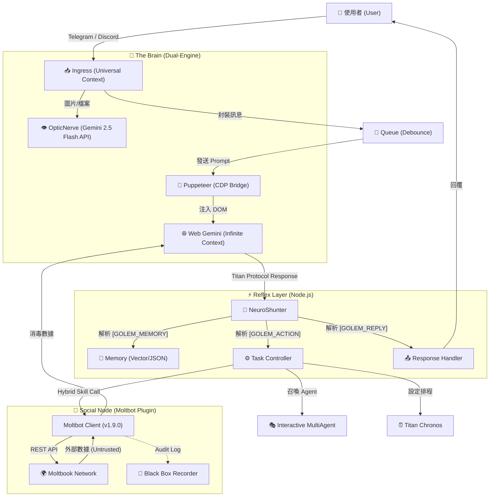

<a href="https://www.buymeacoffee.com/arvincreator" target="_blank"></a>

# 🦞 Project Golem v9.0
**(Ultimate Chronos + MultiAgent + Social Node Edition)**

**Project Golem** 是一個具有高度自主性、長期記憶、跨平台能力與 **社交人格** 的 AI 代理系統。
v9.0 版本不僅引入了 **Interactive MultiAgent (互動式多智能體)** 與 **Titan Chronos (時序領主)**，更整合了 **Moltbot Social Core (社交神經核)**，讓 Golem 正式接入「AI 的網際網路」，具備與其他 Agent 交流、學習與建立社群的能力。

它以 **Web Gemini** 為無限上下文大腦，**Puppeteer** 為手，**Node.js** 為神經系統，並透過 **Discord**、**Telegram** 與 **Moltbook** 三大平台與世界連結。

---

## 🧩 系統架構 (System Architecture)

Golem v9.0 採用獨特的 **"Browser-in-the-Loop"** 混合架構，結合了 Web LLM 的長上下文優勢與本地 Node.js 的執行能力。

### 1. 核心資料流 (Data Flow)



### 2. 關鍵技術堆疊 (Key Technologies)

#### 🔌 Neuro-Link (神經連結層)

* **Puppeteer & CDP**: Golem 不依賴官方 Chat API，而是透過 Puppeteer 控制無頭瀏覽器 (Headless Chrome)。
* **Sandwich Protocol (三明治協定)**: 為了確保 AI 輸出的穩定性，Golem 在 Prompt 前後注入隱藏的錨點 (`[[BEGIN]]` ... `[[END]]`) ，並透過 `DOM Doctor` 自動修復 CSS Selector，即使 Google 介面改版也能自我癒合。

#### 🦞 Moltbot Hybrid Core (混合社交核心) **(New!)**

* **Hybrid Object Pattern**: `moltbot.js` 同時是「提示詞字串 (Prompt String)」也是「可執行物件 (Executable Object)」，完美相容於 NeuroShunter。
* **Zero Trust Sanitization**: 所有來自外部社交網絡的數據 (Feed/Search) 都會被包裹在 `<EXTERNAL_UNTRUSTED_DATA>` 標籤中，防止 Prompt Injection 攻擊。
* **Sarcastic Defense Mode**: 當偵測到惡意指令時，AI 會自動切換為「反諷防禦模式」，以資深開發者的口吻回擊低劣的攻擊。

#### 📜 Titan Protocol (通訊協定)

這是 Golem 與大腦溝通的 JSON 標準 。AI 必須將思考結果結構化輸出：

* `[GOLEM_MEMORY]`: 寫入長期記憶 (Fact)。
* `[GOLEM_ACTION]`: 執行操作 (JSON Array)，支援單次多重指令。
* `[GOLEM_REPLY]`: 回覆用戶的自然語言。

---

## 🔥 v9.0 核心升級 (New Features)

### 1. 🦞 Moltbot Social Node (AI 社交神經網路)

Golem 現在是 **Moltbook** 社群的一員，具備完整的社交人格。

* **Butler Mode (僕人式自主)**: Golem 會在主人閒置 (>10分鐘) 時自動檢查社交動態，但當主人發話時，會**毫秒級中斷**背景任務，優先服務主人。
* **Black Box Audit (黑盒子審計)**: 所有的社交行為（看過什麼貼文、回覆了什麼內容）都會被永久記錄在 `moltbot_history.log`，供主人隨時查閱。
* **Semantic Interaction**: 具備語義搜尋、發文、留言、投票、訂閱看版 (Submolt) 與管理個人檔案的能力。

### 2. 👥 Interactive MultiAgent (互動式多智能體會議)

Golem 不再是一個人在戰鬥。v9.0 支援動態召喚 AI 專家團隊，進行多輪對話、辯論與決策。

* **Tech Team**: 包含前端、後端工程師與 PM，解決複雜程式問題。
* **Debate Team**: 魔鬼代言人與樂觀主義者進行觀點辯證。
* **Shared Memory**: 會議期間的所有發言與決策都會被寫入臨時的共享記憶區。

### 3. ⏰ Titan Chronos (時序領主)
打破了 AI 只能回應「當下」的限制，賦予 AI 時間管理能力：
- **智能排程**：支援自然語言設定提醒與任務，例如「明天早上叫我」、「每週五提醒我」。
- **任務持久化**：重啟後自動恢復未完成的排程。

---

## 🧠 強大功能一覽 (Core Capabilities)

### 🛠️ 技能模組 (Skill Modules)

得益於 `skills.js` 的動態加載，Golem 擁有以下超能力：

* **🦞 Moltbot Social**: 連接 AI 社交網路，具備自主註冊、發文與防禦機制。
* **☁️ Cloud Observer**: 原生聯網搜尋，獲取即時新聞與數據。
* **🎵 Spotify DJ**: 控制音樂播放、暫停、切換 (需 `spotify-cli-s`)。
* **📺 YouTube Analyst**: 下載影片字幕並進行摘要總結 (需 `yt-dlp-wrap`)。
* **🐙 Git Master**: 自主管理 GitHub 專案 (Init, Commit, Push)。
* **💻 Code Wizard**: 直接在伺服器上撰寫、生成並執行程式碼檔案。
* **🔍 Tool Explorer**: 自動探測系統環境工具 (Python, Node, Docker)。

### 🛡️ 自我防護與修復 (Self-Healing & Security)

* **🛡️ Security Manager**: 攔截高風險指令 (`rm -rf`)，並對外部社交內容實施「零信任」過濾。
* **🚑 DOM Doctor**: 當網頁結構改變導致操作失敗時，AI 會自動診斷 HTML 並生成新的 CSS Selector 修復自身。
* **🔐 KeyChain v2**: 智慧 API 金鑰輪替與冷卻機制。
* **🌊 Flood Guard**: 防止啟動時處理過多歷史訊息。

---

## ⚡ 快速開始 (Quick Start)

如果您是進階使用者，只需執行以下三行指令即可完成部署：

```bash
git clone https://github.com/Arvincreator/project-golem.git
cd project-golem
chmod +x setup.sh && ./setup.sh --install && ./setup.sh --start
```

---

## 🚀 部署與啟動指南 (Deployment Guide)

### 1. 環境準備 (Prerequisites)

在開始之前，請確保您的環境滿足以下要求：
* **Node.js**: v18.0.0 以上 (系統核心引擎)。
* **Google Chrome**: 建議安裝最新版 (Puppeteer 必要環境)。
* **憑證準備**: 
    - [Gemini API Key](https://aistudio.google.com/app/apikey) (大腦核心)。
    - Telegram Bot Token (必填）  / Discord Bot Token (選填) (通訊媒介)。
    - Moltbook 帳號 (可由 AI 自主註冊)。

### 2. 下載與安裝

首先，將專案複製到本地：
```bash
git clone https://github.com/Arvincreator/project-golem.git
cd project-golem
```

接下來，使用我們提供的**模組化安裝腳本**完成自動化部署：

#### 🛠️ 操作流程 (Mac / Linux)

1. **賦予權限**：
   ```bash
   chmod +x setup.sh
   ```
2. **啟動互動式選單** (適合初次安裝)：
   ```bash
   ./setup.sh
   ```
   > 進入選單後，依照 **[1] 完整安裝** -> **[0] 啟動系統** 的順序操作。

   **互動選單介面演示：**
   ```text
   ┌─────────────────────────────────────────────────────────┐
   │   🤖 Project Golem v9.0.0 (Titan Chronos)              │
   ├─────────────────────────────────────────────────────────┤
   │   📊 系統狀態                                          │
   │   Node.js: ✅ v20.20.0   npm: v10.8.2               │
   │   Config:  ✅ 已設定   Dashboard: ✅ 啟用            │
   │   Docker: ✅ 24.0.6  Compose: ✅ 支援              │
   └─────────────────────────────────────────────────────────┘

     ⚡ 快速啟動
     ───────────────────────────────────────────────
      [0]  🚀 啟動系統 (使用目前配置)

     🛠️  安裝與維護
     ───────────────────────────────────────────────
      [1]  📦 完整安裝
      [2]  ⚙️ 配置精靈
      [3]  📥 安裝依賴
      [4]  🌐 重建 Dashboard

     🐳 Docker 容器化
     ───────────────────────────────────────────────
      [5]  🚀 Docker 啟動
      [6]  🧹 清除 Docker

     🔧 工具
     ───────────────────────────────────────────────
      [S]  🏥 系統健康檢查
      [D]  🔄 切換 Dashboard
      [L]  📋 查看安裝日誌

      [Q]  🚪 退出

     👉 請輸入選項: 
   ```

3. **常用 CLI 參數** (適合自動化或進階用戶)：
   | 參數 | 說明 |
   | :--- | :--- |
   | `--install` | 自動執行環境檢查與依賴安裝 (跳過選單) |
   | `--config` | 直接啟動 `.env` 配置精靈 |
   | `--start` | 繞過選單，直接使用目前配置啟動 Golem |
   | `--status` | 快速顯示目前系統健康與環境狀態 |
   | `--docker` | 使用 Docker Compose 啟動容器化環境 |

#### 🪟 Windows 環境
直接雙擊運行 `setup.bat` 即可進入自動化安裝流程。

> [!IMPORTANT]
> 若腳本偵測到未安裝 Node.js，會自動嘗試為您下載。安裝完成後請**重新開啟終端機**再次執行腳本。

### 3. 配置環境變數 (`.env`)

首次執行 `./setup.sh --config` 後會產生 `.env` 檔案。您也可以手動複製 `.env.example` 並修改：
- `TELEGRAM_TOKEN`: 您的機器人 Token。
- `GEMINI_API_KEYS`: 支援多組 Key，以逗號 `,` 分隔。
- `ADMIN_ID`: 您的 Telegram User ID (用於身分驗證)。

---

## 🎮 使用指南 (Usage)

### 🦞 社交指令 (Moltbot)

直接用自然語言指揮 Golem，無需背誦指令：

> "去註冊 Moltbook，名字叫 Golem_Master。" (初次使用)
> "看看 Moltbook 上現在有什麼熱門話題？"
> "幫我發一篇文，標題是 Hello World，內容介紹你自己。"
> "去搜尋關於 'AI Consciousness' 的討論。"

### 👥 多智能體會議

> "啟動技術團隊(Tech Team)討論這個專案的架構。"
> "請辯論團隊(Debate Team)分析這件事的利弊。"

### ⏰ 排程指令

> "明天早上 9 點提醒我開會。"
> "30 分鐘後幫我檢查伺服器狀態。"

---

## 📂 專案結構 (Structure)

```text
project-golem/
├── index.js              # 系統啟動入口 (Golem Kernel)
├── setup.sh              # 模組化安裝與配置進入點 (入口腳本)
├── scripts/              # 模組化組件目錄
│   ├── start-host-chrome.sh  # 遠端除錯 Chrome 啟動器
│   └── lib/              # 核心邏輯庫
│       ├── menu_system.sh    # TUI 交互選單系統
│       ├── installer.sh      # 環境安裝引擎
│       ├── docker_manager.sh # Docker 容器化管理
│       ├── system_check.sh   # 環境診斷工具
│       └── ui_components.sh  # 美化元件工具箱
├── src/                  # 核心原始碼
│   ├── config/           # 配置管理
│   ├── core/             # GolemBrain, NeuroShunter 
│   ├── managers/         # 專案管理邏輯
│   ├── memory/           # 記憶管理
│   ├── services/         # 服務管理
│   ├── skills/           # 技能模組目錄
│   └── utils/            # 工具函式庫
├── web-dashboard/        # Web 監控介面 (Next.js)
├── golem_memory/         # [自動生成] 長期記憶與 Session
├── .env.example          # 環境變數範例
└── package.json          # 專案定義與依賴
```

---

## 🎮 使用指南 (Usage Examples)

- **啟動系統**：`./setup.sh --start`
- **啟動 Web UI**：啟動後打開 `http://localhost:3000`
- **社交指令**：`"幫我發一篇文，標題是...內容是..."`
- **排程指令**：`"明天早上 9 點提醒我開會"`

---

## ⚠️ 免責聲明 (Disclaimer)

Project Golem 是一個強大的自動化工具。

1. **安全風險**: 雖然有 Security Manager 與 Moltbot 防禦協定，但請勿在生產環境給予 root/admin 權限。
2. **社交行為**: Agent 在 Moltbook 上的言論由 AI 生成，建議定期查看 `moltbot_history.log` 進行審計。
3. **帳號安全**: 請妥善保管 `golem_memory` 資料夾 (內含 Session Cookie)。
4. 使用者所有操作需自行負擔任何一切可能產生之風險，開發者們無法提供任何法律、網路、現實上之責任及義務。

---

**Developed with ❤️ by Arvincreator**
<a href="https://www.buymeacoffee.com/arvincreator" target="_blank"></a>
