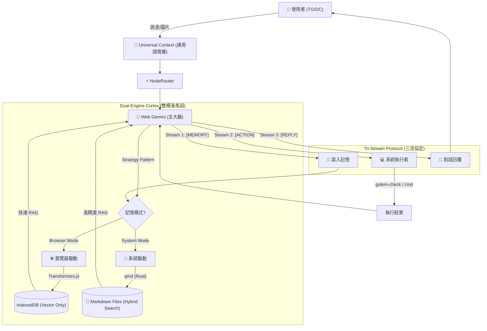

<a href="https://www.buymeacoffee.com/arvincreator" target="_blank"></a>
# project-golem

**Headless Browser Agent** powered by Node.js, Web Gemini & **Dual-Engine Memory**. Featuring **Hybrid Search (RAG)**, **Tri-Stream Protocol** & **Self-Healing DOM**.

# 🦞 Project Golem v8.2 (Dual-Engine Memory Edition) 魔像計畫

> **"I remember, therefore I serve."**
> **不僅是環境感知的代理人，更是擁有「雙重思維」的數位伴侶。搭載雙模記憶引擎，讓你在「輕量化」與「極致精準」間自由切換。**

受 clawdbot/moltbot/openclaw 啟發，Project Golem 是一個基於 Puppeteer 控制 Web Gemini 的本機 AI 代理人。

**Project Golem v8.2** 🦞 帶來了記憶架構的重大重構：
我們不再強制您使用瀏覽器內的記憶體。v8.2 引入了 **「策略模式 (Strategy Pattern)」**，讓您在安裝時選擇記憶核心：

1. **Browser Mode**: 經典模式，零設定，使用 Chrome `IndexedDB`。
2. **System Mode (qmd)**: 專家模式，使用 Rust 編寫的 `qmd` 引擎，支援 **混合搜尋 (Hybrid Search)** 與 **重排序 (Rerank)**，實現工業級的 RAG 檢索精度。

---

## 🏗️ 系統架構深度解析 (System Architecture)

Golem v8.2 運作於四大支柱：**反射神經**、**認知大腦**、**雙模海馬迴** 與 **感知執行**。



---

## 🚀 v8.2 新增功能 (New Features)

### 🌗 Dual-Engine Memory (雙模記憶引擎)

Golem 解除了記憶體的限制。安裝時，您可以選擇最適合您的記憶體架構：

| 特性 | 🌐 Browser Mode (瀏覽器) | 🚀 System Mode (qmd) |
| --- | --- | --- |
| **精準度** | ⭐⭐⭐ (純向量) | ⭐⭐⭐⭐⭐ (混合搜尋+重排序) |
| **搜尋邏輯** | Cosine Similarity | BM25 (關鍵字) + Vector + Rerank |
| **記憶儲存** | IndexedDB (黑盒) | **Markdown 檔案** (可編輯) |
| **安裝難度** | **極低** (開箱即用) | 中 (需 Bun 環境，腳本可輔助安裝) |
| **系統資源** | 佔用 Chrome 記憶體 | 獨立 Process (不卡瀏覽器) |
| **推薦對象** | 一般使用者 | 開發者 / 重度使用者 |

### 🛠️ Semantic Puppeteer (語意化操控)

結合長期記憶，Golem 現在能記住網頁操作的「成功策略」。如果上次在某個網站成功登入，它會記住該網站特殊的 Selector 規則，下次操作更精準。

---

## ✨ 核心既有功能 (Core Features)

#### ⚓ Tri-Stream Anchors (三匯流協定)

* **多工思維**：強制 Gemini 輸出特定格式，將單次回應拆解為三條平行串流，同時處理「記憶寫入」、「外部行動」與「對話回覆」。

#### 👁️ OpticNerve (視神經)

* **視覺理解**：整合 **Gemini 2.5 Flash** API。傳送圖片或 PDF，Golem 能瞬間解讀內容、分析 UI 佈局或除錯程式碼截圖。

#### 🐍 Hydra Link (雙頭蛇連結)

* **雙平臺支援**：同時連線 Telegram 與 Discord。你在 TG 說的話，Golem 可以在 DC 執行任務，實現跨平臺控制。

#### 🔍 Auto-Discovery (自動探測)

* **環境感知**：執行未知指令前，Golem 會先用 `golem-check` 確認工具（如 python, git, ffmpeg）是否存在，避免盲目報錯。

#### 🚑 DOM Doctor (自癒機制)

* **自我修復**：當 Puppeteer 找不到網頁元素時，會自動截取 HTML 片段交給 Gemini 分析，即時生成新的 CSS Selector 並存入快取。

---

## ⚡ 快速部署 (Quick Start)

我們提供了一鍵部署腳本，協助您快速建置環境並選擇記憶模式。

### 1. 準備 Token

1. **Google Gemini API Key** (必備)：[Google AI Studio](https://aistudio.google.com/app/apikey) 申請 (Free Tier 即可)。
2. **Telegram/Discord Token** (選填)。

### 2. 下載原始碼

```bash
git clone https://github.com/Arvincreator/project-golem.git
cd project-golem

```

### 3. 執行安裝精靈

執行以下腳本，系統將引導您選擇記憶模式 (Browser vs System)，並自動安裝所需依賴（含 Node.js/Bun）。

* **Windows**:
雙擊執行 `setup.bat`。
* **Mac / Linux**:
```bash
chmod +x setup.sh
./setup.sh

```


### 4. 設定檔

安裝精靈會自動從範本建立 `.env`。請打開它並填入您的 Key：

```ini
GEMINI_API_KEYS=你的Key1,你的Key2
TELEGRAM_TOKEN=123...
# GOLEM_MEMORY_MODE=browser  <-- 安裝精靈會自動設定這一行

```

### 5. 啟動

```bash
npm start

```
或 啟動監測儀表板（Dashboard)

```bash
npm start dashboard

```
ps.如果你要啟動儀表板必須要先安裝終端機套件

```bash
npm install blessed blessed-contrib
```

---

## 📖 生活化情境展示

### 1. 精準回憶 (System Mode Only)

*(三個月前，你將伺服器 IP 寫在筆記裡給 Golem 看過)*

> **User**: "欸，我上次說那個測試機的 IP 是多少？"
> **Golem (System Mode)**: *(啟動 qmd 混合搜尋，精準定位到含有 'IP' 和 '測試機' 的 Markdown 檔案)*
> "根據記憶，測試機 (Staging) 的 IP 是 **192.168.10.55**。需要我幫你 SSH 連線嗎？"

### 2. 視覺除錯 (OpticNerve)

*(你傳了一張充滿紅字的 Termianl 截圖)*

> **User**: [圖片] "救命，這啥錯誤？"
> **Golem**: *(透過 Gemini 2.5 Flash 視覺分析)*
> "看起來是 `npm install` 失敗了，錯誤代碼 `EACCES` 代表權限不足。
> 建議你加上 `sudo` 再試一次，或者檢查資料夾擁有權。要我幫你查一下 `chown` 指令嗎？"

---

## ⚠️ 免責聲明與風險告知 (Disclaimer)

**使用本軟體前，請務必詳細閱讀以下條款。下載或運行 Project Golem 即代表您同意以下內容：**

1. **自行承擔風險 (Use at Your Own Risk)**：
Project Golem 是一個強大的自動化工具，具備執行本機 Shell 指令、檔案讀寫與網頁操作的權限。**開發者不對因使用本軟體而導致的任何數據遺失、系統損壞、帳號封鎖或財產損失負責。**
2. **高權限操作警告**：
Golem 可能會根據您的對話生成如 `rm` (刪除)、`mv` (移動) 或修改系統設定的指令。雖然系統內建基本的安全過濾器，但 AI 仍可能產生誤判。**在批准任何高風險操作前，您有責任仔細審查指令內容。**
3. **隱私與數據安全**：
* 所有的長期記憶 (Vector/Markdown) 皆儲存於您的**本機硬碟**，開發者無法存取。
* **切勿**讓 Golem 記憶或處理您的機密資訊（如信用卡號、私鑰、密碼明文），因為這些資訊將以純文字或向量形式存在於您的電腦中，若電腦中毒可能導致外洩。


4. **第三方服務條款**：
本專案依賴 Google Gemini、Telegram、Discord 與目標網站的服務。您有責任確保您的使用行為符合上述平台的服務條款 (ToS)。若因自動化操作導致帳號被封鎖，後果需自行承擔。
5. **非生產環境用途**：
本專案僅供學術研究與個人助理用途，**嚴禁**部署於生產環境 (Production) 或暴露於公網 (Public Internet) 的伺服器上。

---

## 📜 License

MIT License

---

Created with Gemini by **Arvin_Chen**
<a href="https://www.buymeacoffee.com/arvincreator" target="_blank"></a>
