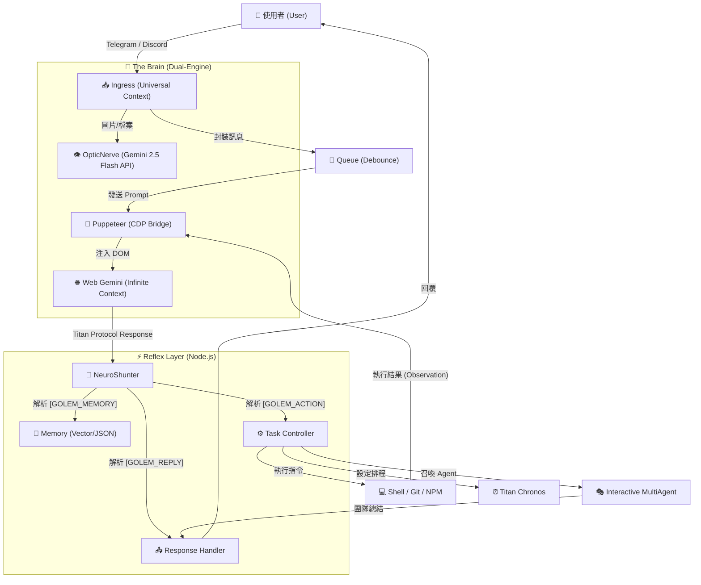

<a href="https://www.buymeacoffee.com/arvincreator" target="_blank"></a>


# 🦞 Project Golem v9.0 (Ultimate Chronos + MultiAgent Edition)

**Project Golem** 是一個具有高度自主性、長期記憶與跨平台能力的 AI 代理系統。
v9.0 版本引入了革命性的 **Interactive MultiAgent (互動式多智能體)** 架構與 **Titan Chronos (時序領主)** 引擎，讓 AI 不僅能跨越時間排程，更能召喚專家團隊進行協作會議。

它以 **Web Gemini** 為無限上下文大腦，**Puppeteer** 為手，**Node.js** 為神經系統，並透過 **Discord** 與 **Telegram** 雙平台與人類互動。

---

## 🧩 系統架構深度解析 (System Architecture Deep Dive)

Golem v9.0 採用獨特的 **"Browser-in-the-Loop"** 混合架構，結合了 Web LLM 的長上下文優勢與本地 Node.js 的執行能力。

### 1. 核心資料流 (Data Flow)



### 2. 關鍵技術堆疊 (Key Technologies)

#### 🔌 Neuro-Link (神經連結層)

* **Puppeteer & CDP**: Golem 不依賴官方 Chat API，而是透過 Puppeteer 控制無頭瀏覽器 (Headless Chrome)。
* 
**Sandwich Protocol (三明治協定)**: 為了確保 AI 輸出的穩定性，Golem 在 Prompt 前後注入隱藏的錨點 (`[[BEGIN]]` ... `[[END]]`) ，並透過 `DOM Doctor` 自動修復 CSS Selector，即使 Google 介面改版也能自我癒合。


#### 📜 Titan Protocol (通訊協定)

這是 Golem 與大腦溝通的 JSON 標準 。AI 必須將思考結果結構化輸出：

* `[GOLEM_MEMORY]`: 寫入長期記憶 (Fact)。
* `[GOLEM_ACTION]`: 執行操作 (JSON Array)，支援單次多重指令。
* `[GOLEM_REPLY]`: 回覆用戶的自然語言。

#### 🎭 Multi-Agent Orchestrator (多智能體協作)

v9.0 的核心突破。當觸發會議模式時：

1. **Context Switching**: 主腦 (Golem) 暫時退居幕後，轉換為「會議主席」。
2. 
**Round-Robin Execution**: 系統根據 `skills.js` 定義的人格 (如 Alex, Bob)，輪流將 Prompt 注入給大腦，模擬不同專家的發言 。


3. 
**Shared Memory**: 會議期間的所有發言與決策都會被寫入臨時的共享記憶區，供所有 Agent 參考 。


#### ⏰ Titan Chronos (時序引擎)

* **Time Perception**: 每次對話時，系統會注入 `【當前系統時間】` 給 AI。
* **Persistence**: 排程任務被序列化存儲，並由 `TimeWatcher` 每分鐘掃描一次。當時間到達，系統會自動喚醒並執行定義好的 Action。

---

## 🔥 v9.0 核心升級 (New Features)

### 1. 👥 Interactive MultiAgent (互動式多智能體會議)

Golem 不再是一個人在戰鬥。v9.0 支援動態召喚 AI 專家團隊，進行多輪對話、辯論與決策。

* **Tech Team**: 包含前端、後端工程師與 PM，解決複雜程式問題。
* **Debate Team**: 魔鬼代言人與樂觀主義者進行觀點辯證。
* **Visual Interface**: 在 Dashboard 中以專屬青色 (Cyan) 頻道顯示會議實況。
* 
**Human-in-the-loop**: 使用者可隨時介入會議 (插話、暫停、結束) 。


### 2. ⏰ Titan Chronos (時序領主)

打破了 AI 只能回應「當下」的限制。

* **智能排程**: 支援「明天早上叫我」、「每週五提醒我」、「30分鐘後執行」。
* **持久化任務**: 即使系統重啟，排程任務依然存在 (基於 v9.0 記憶架構)。

---

## 🧠 強大功能一覽 (Core Capabilities)

### 🛠️ 技能模組 (Skill Modules)

得益於 `skills.js` 的動態加載，Golem 擁有以下超能力：

* **☁️ Cloud Observer**: 原生聯網搜尋，獲取即時新聞與數據。
* **🎵 Spotify DJ**: 控制音樂播放、暫停、切換 (需 `spotify-cli-s`)。
* **📺 YouTube Analyst**: 下載影片字幕並進行摘要總結 (需 `yt-dlp-wrap`)。
* **🐙 Git Master**: 自主管理 GitHub 專案 (Init, Commit, Push)。
* **💻 Code Wizard**: 直接在伺服器上撰寫、生成並執行程式碼檔案。
* **🔍 Tool Explorer**: 自動探測系統環境工具 (Python, Node, Docker)。

### 🛡️ 自我防護與修復 (Self-Healing & Security)

* **🚑 DOM Doctor**: 當網頁結構改變導致操作失敗時，AI 會自動診斷 HTML 並生成新的 CSS Selector 修復自身。
* **🔐 KeyChain v2**: 智慧 API 金鑰輪替與冷卻機制，防止 Rate Limit。
* **🌊 Flood Guard**: 防止啟動時處理過多歷史訊息。
* **🛡️ Security Manager**: 攔截高風險指令 (`rm -rf`, `format`)，需管理員授權。

### 📺 多模態控制台 (Dual-Mode Dashboard)

Golem v9.0 提供兩種強大的監控介面，讓您隨時掌握系統動向：

* **終端機戰術面板 (TUI)**: 基於 `blessed-contrib`，適合伺服器環境或極客玩家。提供核心心跳、Chronos 雷達與隊列監控。
* **次世代 Web 控制面板 (Web UI v2.0)**: 基於 Next.js 15 的現代化介面，提供更豐富的圖表、即時日誌流與 Agent 會議觀察頻道。
    - **預設網址**: `http://localhost:3000/dashboard`
    - **核心特性**: 實時時序雷達、Agent 互動監控、神經日誌流感應器。

---

## 🚀 快速部署 (Quick Deployment)

### 1. 環境準備 (Prerequisites)

* **Node.js**: v18.0.0 或更高版本 (核心要求)。
* **Google Chrome**: 建議安裝最新版 (Puppeteer 依賴)。
* **帳號**: 一個 Google 帳號 (用於 Web Gemini) 與 Gemini API Key (用於視覺分析)。

### 2. 安裝 (Installation)

```bash
# 下載專案
git clone https://github.com/YourRepo/project-golem.git
cd project-golem

# 安裝依賴 (包含 Puppeteer, Discord.js, etc.)
npm install

```

### 3. 設定 (Configuration)

在專案根目錄建立 `.env` 檔案，填入以下資訊 ：

```env
# --- 機器人 Token (至少填一個) ---
TELEGRAM_TOKEN=你的_TG_Bot_Token
DISCORD_TOKEN=你的_DC_Bot_Token

# --- 管理員 ID (必須設定，否則無法執行敏感指令) ---
ADMIN_ID=你的_TG_ID
DISCORD_ADMIN_ID=你的_DC_ID

# --- 核心腦部 (選填，若無則視覺功能受限) ---
# 用於 OpticNerve 視覺分析與 DOM Doctor 診斷
GEMINI_API_KEYS=key1,key2,key3

# --- 系統配置 ---
# 記憶模式: browser (推薦), native, qmd
GOLEM_MEMORY_MODE=browser
# 瀏覽器資料存檔位置 (保留登入狀態)
USER_DATA_DIR=./golem_memory

```

### 4. 啟動 (Launch)

**模式 A: 標準啟動 (背景執行)**

```bash
npm start

```

*說明：這會以標準模式啟動，僅在 Console 輸出基本日誌。*

**模式 B: 戰術控制台 (推薦，可視化監控 v9.0)**

```bash
npm run dashboard
# 或
node index.js dashboard

```

說明：這會啟動全螢幕戰術儀表板，支援滑鼠操作與即時監控 。

---

## 🎮 使用指南 (Usage)

### 基礎指令

* `/help`: 顯示說明書。
* `/callme [名字]`: 設定你的稱呼。
* `/donate`: 支持開發者。

### 👥 多智能體會議 (v9.0 New)

直接用自然語言告訴 Golem：

> "啟動技術團隊(Tech Team)討論這個專案的架構。"
> "請辯論團隊(Debate Team)分析這件事的利弊。"

在會議中，你可以：

* 輸入 `繼續`：讓討論繼續。
* 輸入 `中斷`：暫停會議。
* 輸入 `@Alex`：指定某位 Agent 回答。

### ⏰ 排程指令 (Chronos)

> "明天早上 9 點提醒我開會。"
> "30 分鐘後幫我檢查伺服器狀態。"

### 🎵 多媒體與工具

> "播放 Lo-Fi 音樂。" (Spotify)
> "總結這部 YouTube 影片：[連結]"
> "幫我寫一個 Python 爬蟲並存成檔案。"

---

## 📂 專案結構 (Structure)

```text
project-golem/
├── index.js          # 核心主程式 (v9.0 MultiAgent Kernel)
├── skills.js         # 技能定義書 (v9.0 Skills - Agent Presets)
├── dashboard.js      # 儀表板外掛 (v9.0 Monitor - Cyan Channel)
├── dashboard/        # Web Server 元件
├── golem_memory/     # [自動生成] 記憶與瀏覽器緩存
├── .env              # [必須建立] 環境變數
└── package.json      # 依賴配置

```

---

## ⚠️ 免責聲明 (Disclaimer)

Project Golem 是一個強大的自動化工具，擁有執行系統指令的能力。

1. 
**安全風險**: 雖然有 Security Manager，但請勿在生產環境給予 root/admin 權限 。


2. **帳號安全**: Web Gemini 依賴您的 Google 帳號，請妥善保管 `golem_memory` 資料夾 (內含 Session Cookie)。
3. **自主性**: AI 可能會產生幻覺或執行非預期操作，請始終保持監控。

---

**Developed with ❤️ by Arvincreator**
[Buy Me a Coffee](https://buymeacoffee.com/arvincreator)
<a href="https://www.buymeacoffee.com/arvincreator" target="_blank"></a>
