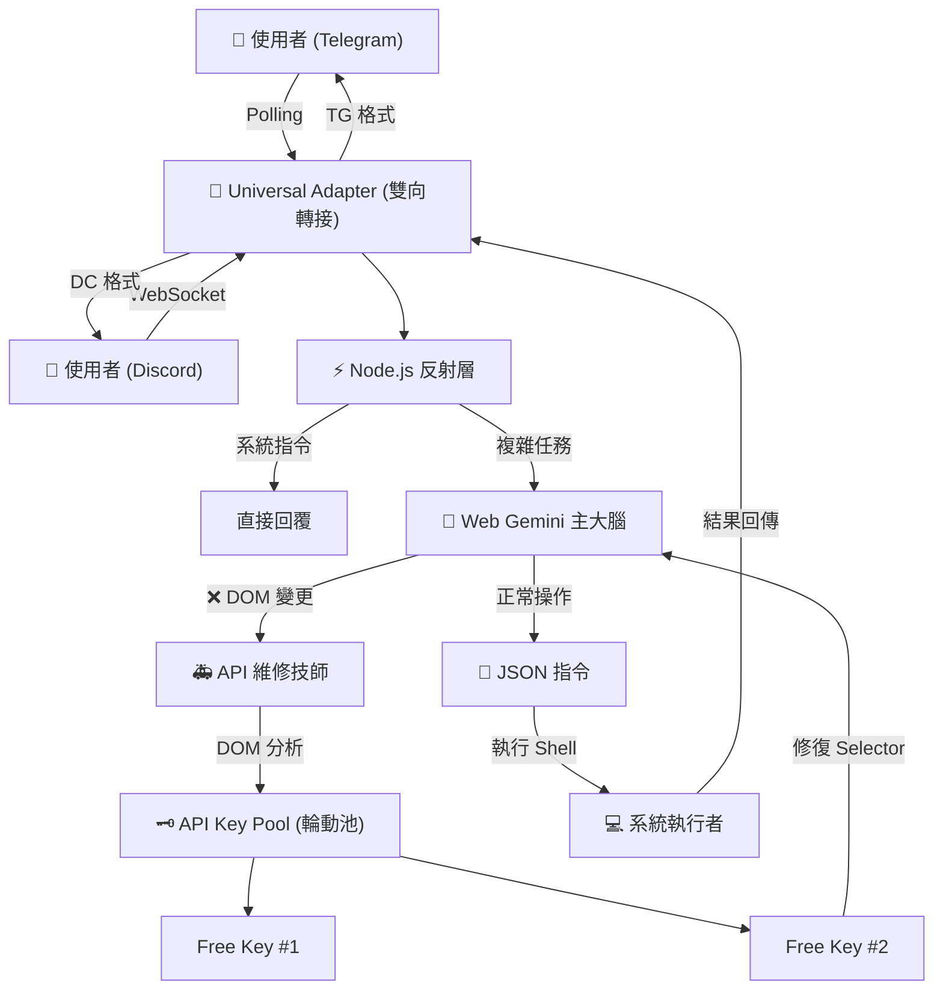

# project-golem

Headless browser agent powered by Node.js, Web Gemini & Gemini API (Multi-Key Rotation). Now supporting **Telegram & Discord Dual-Link**.

# 🦞 Project Golem v7.2 (Hydra Dual-Link) 魔像計畫

> **"Two Heads, Three Minds, One Body."**
> **雙平台同步運作、多重人格切換、免費 API 輪動。打造一個同時活在 Telegram 與 Discord 的進化型 AI 代理人。**

受 clawdbot/moltbot/openclaw 啟發，我做了一個 Project Golem (v7.2)。 目標是用 Gemini 網頁版 來達成完全免費的本機控制。

**Project Golem v7.2** 🦞 這是一個基於 Puppeteer 的「雙腦實驗」：
這是一次通訊層的重大進化，我們引入了 **「九頭蛇架構 (Hydra Architecture)」**。現在，Golem 可以同時監聽 Telegram 與 Discord 的訊息，並共用同一個 Web Gemini 大腦與記憶庫。無論你在哪個平台下指令，它都能無縫接軌。

當然，它依然保留了 **KeyChain 輪動機制**，讓你利用多組 Google 免費 API Key，實現**理論上的無限免費使用**與**高可用性自癒**。

---

## 💸 關於費用的秘密：如何達成 100% 免費？ (The Zero-Cost Strategy)

許多人擔心引入 API 會產生費用，但在 Golem v7.2 中，我們設計了巧妙的架構來規避這點：

1. **平時運作 (0 元)**：
* Golem 的「主大腦」使用的是 **Google Gemini Web 版** (gemini.google.com)。
* 這是完全免費的，且擁有無限的 Context Window (上下文記憶)。


2. **維修運作 (0 元 - 利用 Free Tier)**：
* 當 Web 版介面改版或找不到按鈕時，Golem 會呼叫 **API 維修技師**。
* Google Gemini API 提供 **Free Tier (免費層級)**，雖然有速率限制 (Rate Limit)，但對個人使用已足夠。


3. **無限輪動 (Key Rotation)**：
* **原理**：如果你只有一把 Key，短時間內大量報錯可能會撞到 API 限制 (429 Error)。
* **解法**：Golem 內建 **`KeyChain`** 負載平衡器。你可以申請 **3~5 組免費的 Google API Key** 填入系統。
* **效果**：當 Key #1 額度耗盡或過熱，系統毫秒級自動切換到 Key #2。只要準備足夠的免費 Key，你就能獲得**近乎無限且免費**的 API 容錯能力。


---

## 🌟 v7.2 核心特性 (Hydra Features)

### 🐍 九頭蛇雙連結 (Hydra Dual-Link) [New!]

* **雙棲模式**：Golem 現在可以同時登入 Telegram Bot 與 Discord Bot。
* **無縫大腦**：你在 Telegram 教它的事，它在 Discord 也會記得。記憶體 (`golem_learning.json`) 是全平台共用的。
* **原生體驗**：
* 在 Telegram 支援 `Markdown` 與 `Inline Buttons`。
* 在 Discord 支援 `Slash Commands` 風格操作與 `Button Interactions`。


* **伺服器端運作**：使用者（你的朋友）用手機操作即可，不需要安裝任何東西。

### 🧠 三層大腦架構 (The Tri-Brain System)

1. **⚡ 第一層：Node.js 反射層 (The Reflex)**
* **職責**：處理 `/help`, `/callme`, `/patch` 等系統指令，以及跨平台訊息轉譯 (Universal Context)。
* **特點**：**零延遲**，不經過 AI 思考，就像膝跳反應一樣快。


2. **🧠 第二層：Web Gemini 主大腦 (The Primary Brain)**
* **職責**：處理複雜對話、聯網搜索、邏輯推演、角色扮演。
* **特點**：負責思考並生成標準化的 JSON 操作指令。


3. **🚑 第三層：API 維修技師 (The Doctor)**
* **職責**：當 Web 版 Puppeteer 操作失敗 (如 Selector 失效) 時介入。
* **特點**：它會閱讀當下的 HTML 原始碼，分析出新的按鈕位置，並**熱修復**記憶體中的變數，讓系統繼續運作。


### 🎭 百變怪角色扮演 (Actor Mode)

* **對話層 (Chat)**：你可以要求它扮演傲嬌貓娘、冷酷駭客、中世紀騎士或任何角色。它會用該角色的語氣與你對話。
* **指令層 (Action)**：無論它扮演得多麼投入，底層的 Node.js 執行邏輯永遠保持冷靜、精準。

### 🧬 銜尾蛇進化協議 (Ouroboros Protocol)

繼承自 v6.4 的強大基因，讓 AI 自己寫代碼升級自己：

* **內省機制 (Introspection)**：讀取自身源碼 (`index.js`, `skills.js`)。
* **自主覺醒 (Autonomy)**：隨機時間甦醒，主動提出優化 Patch (預設發送給 Admin)。
* **神經補丁 (Neural Patching)**：生成 Patch -> 建立 `index.test.js` 分身 -> 沙箱測試 -> 熱更新重啟。

---

## 🏗️ 系統運作流程 (Architecture)



---

## ⚡ 快速部署 (Quick Start)

**不再需要安裝 Ollama！不再需要高階顯卡！**

### 1. 準備必要 Token

1. **Google Gemini API Key** (必備，越多越好)：前往 [Google AI Studio](https://aistudio.google.com/app/apikey) 申請。
2. **Telegram Bot Token** (選填)：向 [@BotFather](https://t.me/botfather) 申請。
3. **Discord Bot Token** (選填)：前往 [Discord Developer Portal](https://www.google.com/search?q=https://discord.com/developers/applications) 申請 (記得開啟 `Message Content Intent`)。

### 2. 下載原始碼

1. 下載專案：
```bash
git clone https://github.com/Arvincreator/project-golem.git
cd project-golem

```


2. **確認檔案**：請確保資料夾內有 `index.js` 和 `skills.js`。

### 3. 自動化安裝 (Windows / Mac / Linux)

我們提供了智慧安裝腳本，會自動偵測作業系統並安裝環境：

* **Windows**: 雙擊 `setup.bat`。
* **Mac / Linux**:
```bash
chmod +x setup.sh
./setup.sh

```


腳本將自動：

* 🧹 清理舊環境。
* 📦 安裝 `discord.js`, `node-telegram-bot-api`, Puppeteer 等依賴。
* 📝 自動建立 v7.2 版的 `.env` 設定檔。

### 4. 設定檔 `.env` (關鍵步驟！)

安裝完成後，打開 `.env` 檔案，填入你的 Keys：

```ini
# 1. Gemini API Keys (輪動池)
GEMINI_API_KEYS=你的Key1,你的Key2,你的Key3

# 2. Telegram 設定 (左頭)
TELEGRAM_TOKEN=123456:ABC-DEF...
ADMIN_ID=12345678 (你的 TG ID)

# 3. Discord 設定 (右頭)
DISCORD_TOKEN=MTE2... (你的 DC Bot Token)
DISCORD_ADMIN_ID=987654321 (你的 DC ID)

```

### 5. 啟動

```bash
npm start

```

*首次啟動會跳出 Chrome 視窗，請**手動登入 Google 帳號**一次，之後即可最小化。*

---

## 📖 操作手冊 (User Manual)

### 雙平台同步 (Dual-Link Demo)

1. 在 **Telegram** 對 Golem 說：`記住，我的代號是 'Shadow'。`
2. Golem (TG) 回覆：`收到，Shadow。`
3. 打開 **Discord**，對 Golem 說：`我是誰？`
4. Golem (DC) 回覆：`你是 Shadow。`
*(因為大腦是共用的，記憶也是同步的！)*

### 系統自癒 (Self-Healing Demo)

如果有一天 Google 改版了網頁結構：

1. Golem 嘗試點擊按鈕失敗。
2. 它會自動切換到 API 模式。
3. API 讀取網頁，發現按鈕的 Class 從 `.submit-btn` 變成了 `.send-v2`。
4. Golem 自動修正變數，重試點擊，成功執行。
5. **你完全感覺不到它壞過。**

---

## ⚠️ 免責聲明 (Disclaimer)

**Project Golem v7.2 是一個具備「修改自身原始碼」與「實體系統操作」能力的實驗性 AI。**

1. **RBAC 安全網**：雖然我們有 `SecurityManager` 攔截 `rm -rf` 等毀滅性指令，但 AI 仍可能產生非預期行為。
2. **API 額度**：雖然使用了輪動機制，但若短時間內發送極大量請求，仍可能暫時被 Google 限制。請合理使用。
3. **備份**：請定期備份 `index.js` 與 `skills.js`。
4. **請勿**在生產環境 (Production) 或存有重要機密資料的電腦上運行。
5. 開發者不對因使用本軟體而導致的任何資料遺失或系統損壞負責。

---

## 📜 License

MIT License

---

Created with 🧠 by **Arvin_Chen**
<a href="[https://www.buymeacoffee.com/arvincreator](https://www.buymeacoffee.com/arvincreator)" target="_blank"></a>
