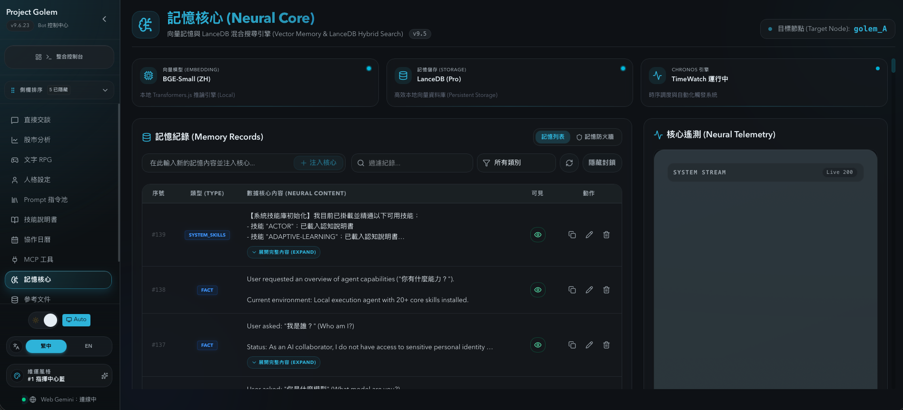
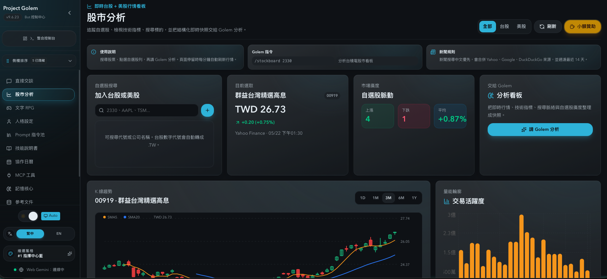
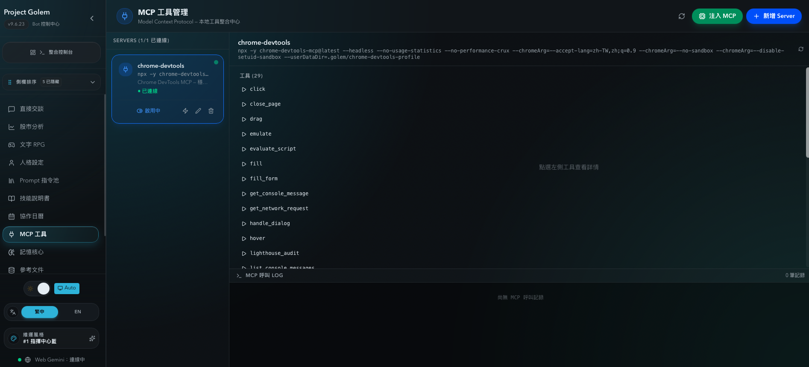
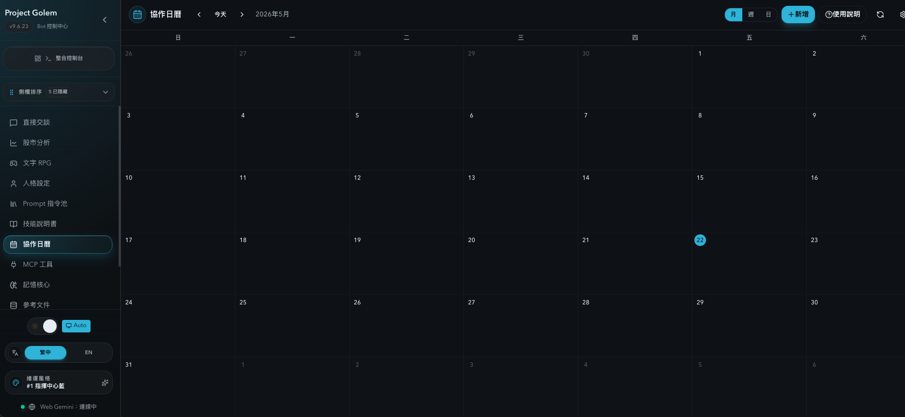
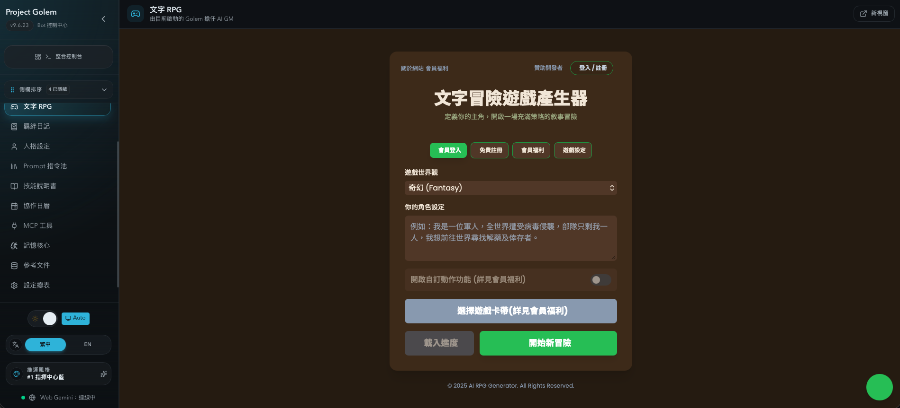

<div align="center">
  
  <h1>Project Golem</h1>
  <p><strong>你的 AI 操作中樞：可對話、可行動、可記憶、可長期協作。</strong></p>

  <p>
    
    
    
    
  </p>

  <p>
    <a href="README.en.md"><strong>English README</strong></a> ·
    <a href="docs/CONTRIBUTING.zh-TW.md">貢獻指南</a> ·
    <a href="docs/AGENTS.md">開發代理指南</a>
  </p>
</div>

---

## Project Golem 是什麼

Project Golem 不是單純聊天機器人，而是一套可運行的 AI 工作系統。  
它把「語言模型能力」和「實際操作能力」整合成同一個執行核心，讓你可以在一個 Dashboard 裡完成：

- 即時對話與任務協作
- 技能掛載與工具擴充（MCP / Skills）
- 長期記憶管理與檢索
- 多代理討論與共識彙整
- RPG 劇情互動、股市看板、協作日曆、羈絆日記
- 系統安全、設定、更新與維運

你可以使用：

- `Gemini Web`（Browser-in-the-Loop，透過 Playwright）
- `Ollama`（本機/私有模型）
- `LM Studio`（OpenAI-compatible local API）

---

## 為什麼它有價值

多數 AI 工具在「一次對話」很強，但在「長期工作」會掉鏈。Project Golem 的設計重心是讓 AI 在真實環境裡持續可用：

- 有狀態：保留長期上下文與記憶
- 有行動：可透過工具與技能執行任務
- 有邊界：具備安全控管與操作限制
- 有介面：透過 Web Dashboard 做人機協作與治理

---

## 適合的使用場景

| 場景 | Golem 可以做什麼 |
| --- | --- |
| 個人 AI 工作台 | 把對話、記憶、工具、設定集中到同一個 Dashboard，不需要在多個 AI 網頁之間切換。 |
| 本機私有 AI | 使用 Ollama 或 LM Studio，讓模型推理與記憶資料留在自己的機器或私有網路內。 |
| 長期專案陪跑 | 透過記憶核心、摘要與技能系統，讓 AI 累積專案背景，而不是每次都重新解釋。 |
| 多代理決策 | 建立不同角色進行討論，例如產品、工程、安全、營運，再整理成可執行結論。 |
| 工具型代理實驗 | 用 MCP 與 Skills 把搜尋、檔案、外部服務、專案工具逐步接進 AI 工作流。 |
| 生活與創作陪伴 | 用文字 RPG、羈絆日記、協作日曆，把 AI 從工具延伸成可共同規劃、共同記錄的互動角色。 |
| 金融資訊看板 | 透過台股/美股股市看板，整理行情、新聞、技術指標與 watchlist，交給 Golem 做分析上下文。 |

---

## 核心能力

| 能力 | 說明 |
| --- | --- |
| 多後端大腦 | 支援 `gemini`、`ollama`、`lmstudio`，可依成本、隱私、效能切換。 |
| Web Dashboard | 預設 `http://localhost:3000/dashboard`，提供對話、監控、設定、技能、MCP、記憶管理。 |
| 長期記憶 | 支援 `lancedb-pro` 與 `native` 記憶模式，含摘要壓縮與檢索流程。 |
| 多代理協作 | Interactive Multi-Agent 模式可建立角色群組做討論與共識輸出。 |
| 技能系統 | 可載入內建/自訂技能，支援安裝、啟用、測試與管理。 |
| MCP 工具擴充 | 可接入標準 I/O MCP server，將外部能力接進 Golem 工作流。 |
| 股市看板 | 支援台股/美股 watchlist、行情、K 線、技術指標、新聞脈絡與 Golem 分析快照。 |
| 協作日曆 | Dashboard 行事曆可建立、更新、刪除行程，並提供 Golem 可讀取的協作排程資料。 |
| 文字 RPG | 原生文字 RPG 模式，支援世界觀/角色建立、選項互動、會員回合數與外部通道綁定。 |
| 羈絆日記 | 使用者日記、AI 日記、AI 想法、週摘要、羈絆等級、SQLite 備份與還原流程。 |
| 外部通道 | 可選 Telegram / Discord bridge。 |
| 安全治理 | 遠端存取保護、操作 token、風險命令防護、權限檢查。 |

---

## 介面預覽









目前 Dashboard（`web-dashboard/src/app/dashboard`）的主路由包含：

- `/dashboard`：Unified Console（Overview + 即時狀態）
- `/dashboard/chat`：聊天工作台
- `/dashboard/diary`：羈絆日記
- `/dashboard/persona`：人格設定
- `/dashboard/prompt-pool`：Prompt Pool
- `/dashboard/prompt-trends`：Prompt 趨勢分析
- `/dashboard/stocks`：股市看板
- `/dashboard/calendar`：協作日曆
- `/dashboard/rpg`：文字 RPG
- `/dashboard/skills`：技能管理
- `/dashboard/mcp`：MCP 管理
- `/dashboard/action-gate`：Action Gate（高風險操作核准流）
- `/dashboard/agents`：代理清單
- `/dashboard/office`：Agent 辦公室 / 協作空間
- `/dashboard/memory`：記憶核心
- `/dashboard/memory-firewall`：記憶防火牆
- `/dashboard/reference-files`：Reference Files
- `/dashboard/settings`：系統設定總覽

---

## 快速開始

### 1) 環境需求

- Node.js `>=20 <23`
- npm
- Chromium / Google Chrome（Gemini Web 模式需要）

### 2) 安裝與啟動（推薦）

Windows（請使用 Git Bash）：

```bash
cd /你的/project-golem-main/資料夾
./setup.sh
```

macOS（請使用終端機 Terminal）：

```bash
cd /你的/project-golem-main/資料夾
./setup.sh
```

按下 Enter 後，系統會自動引導你完成安裝或進入啟動選單。

---

## 最常用指令

| 指令 | 說明 |
| --- | --- |
| `npm run dashboard` | 啟動 runtime + Web Dashboard |
| `npm start` | 啟動核心 runtime |
| `npm run dev` | 開發模式（nodemon） |
| `npm run doctor` | 環境健康檢查 |
| `npm run arch:check` | 架構邊界檢查 |
| `npm test` | 執行測試 |

### 常用對話指令

| 指令 | 說明 |
| --- | --- |
| `/help` | 查看目前可用指令 |
| `/new` | 開新對話並載入相關記憶 |
| `/new_memory` | 重置底層記憶狀態 |
| `/skills` | 查看已安裝技能 |
| `/learn <功能>` | 讓 Golem 嘗試學習或生成新技能 |
| `/stocks TSM NVDA 2330` | 建立即時股市分析上下文 |
| `/stockboard` | 開啟股市看板式分析上下文 |
| `/rpg start` | 啟動原生文字 RPG 模式 |
| `/rpg bind` | 產生會員/外部通道綁定碼 |
| `/install skill-gh <url>` | 從 GitHub 安裝技能 |
| `/install mcp-url <url>` | 從 HTTPS JSON 安裝 MCP 設定 |

---

## 核心設定範例

### Gemini Web（預設）

```env
GOLEM_BACKEND=gemini
GOLEM_MEMORY_MODE=lancedb-pro
PLAYWRIGHT_STEALTH_ENABLED=true
ALLOW_REMOTE_ACCESS=false
```

### Ollama

```env
GOLEM_BACKEND=ollama
GOLEM_OLLAMA_BASE_URL=http://127.0.0.1:11434
GOLEM_OLLAMA_BRAIN_MODEL=llama3.1:8b
GOLEM_EMBEDDING_PROVIDER=ollama
GOLEM_OLLAMA_EMBEDDING_MODEL=nomic-embed-text
```

### LM Studio

```env
GOLEM_BACKEND=lmstudio
GOLEM_LMSTUDIO_BASE_URL=http://127.0.0.1:1234/v1
GOLEM_LMSTUDIO_BRAIN_MODEL=local-model
GOLEM_LMSTUDIO_API_KEY=
```

### 遠端管理安全建議

```env
ALLOW_REMOTE_ACCESS=false
REMOTE_ACCESS_PASSWORD=
SYSTEM_OP_TOKEN=
```

若要開放遠端，請務必同時設定強密碼、token，並搭配防火牆或 VPN。

---

## 部署方式

本機開發與個人使用建議直接跑 Node.js。若要部署到伺服器或 VPS，可以使用 Docker Compose 或 headless/noVNC 流程。

```bash
docker compose up -d --build
```

更多部署細節請看 [Docker 本機部署指南](docs/DOCKER-LOCAL.zh-TW.md) 與 [VPS VNC Setup Guide](docs/VPS_VNC_Setup_Guide.md)。

---

## 專案結構

```text
project-golem/
├── apps/
│   ├── runtime/              # 核心啟動入口
│   └── dashboard/            # Dashboard plugin / app layer
├── src/                      # 核心邏輯（brain, manager, services, bridges）
├── web-dashboard/            # Next.js Dashboard 與前端頁面
├── packages/                 # memory / protocol / security 等共享模組
├── docs/                     # 文件與指南
├── assets/                   # README 截圖素材
├── index.js                  # 相容入口（轉交 apps/runtime）
└── dashboard.js              # 相容入口（Dashboard 啟動）
```

---

## 文件地圖

- [Web Dashboard 使用說明](docs/Web-Dashboard-使用說明.md)
- [MCP 使用與開發指南](docs/MCP-使用與開發指南.md)
- [記憶系統架構說明](docs/記憶系統架構說明.md)
- [Golem 指令說明一覽表](docs/golem指令說明一覽表.md)
- [Docker 本機部署指南](docs/DOCKER-LOCAL.zh-TW.md)
- [VPS VNC Setup Guide](docs/VPS_VNC_Setup_Guide.md)

---

## 授權

本專案採 **Source-Available Non-Commercial** 授權。  
請參考：[LICENSE](LICENSE) 與 [COMMERCIAL-LICENSE.md](COMMERCIAL-LICENSE.md)。

---

## 作者

**Arvin Chen**
