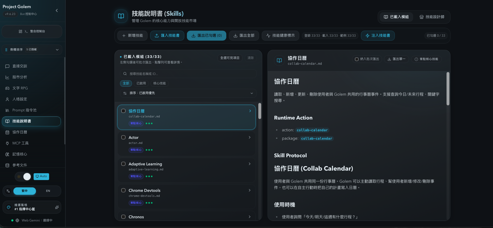
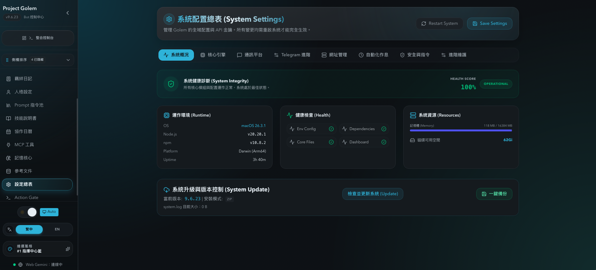
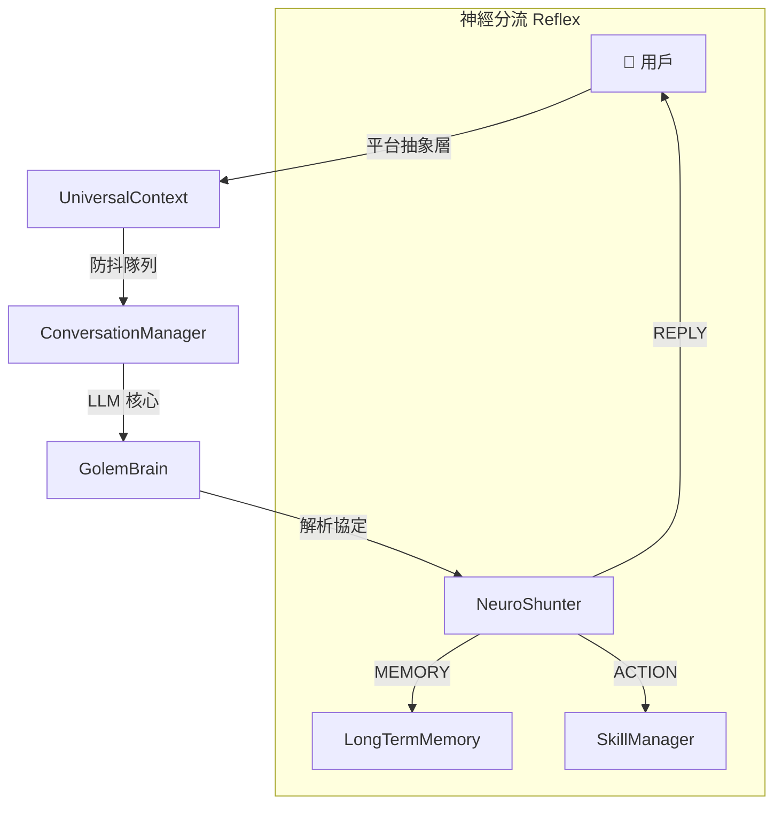

<div align="center">

# 🤖 Project Golem v9.1
> **Ultimate Chronos + MultiAgent + Social Node Edition**


### 具備長期記憶、自由意志與跨平台能力的自主 AI 代理系統

<p>
  
  
  
  
  
</p>

[功能亮點](#-核心亮點) · [系統架構](#-系統架構) · [快速開始](#-快速開始) · [使用案例](#-使用案例與介面展示) · [完整文件](#-完整文件與指南)

<br/>

**繁體中文** | [English](README.en.md) | [貢獻指南](CONTRIBUTING.zh-TW.md)

</div>

---

## ✨ 這是什麼？

**Project Golem** 不是一個普通的聊天機器人。它是一個以 **Web Gemini 的無限上下文**為大腦、以 **Puppeteer** 為雙手的自主 AI 代理系統。

- 🧠 **記住你** — 金字塔式 5 層記憶壓縮，理論上可保存 **50 年**的對話精華。
- 🤖 **自主行動** — 當你不在時，它會主動瀏覽新聞、自省思考、發送消息給你。
- 🎭 **召喚 AI 團隊** — 一個指令生成多個 AI 專家進行圓桌討論，產出共識摘要。
- 🔧 **動態擴充** — 支援熱載入技能模組 (Skills)，甚至能讓 AI 在沙盒中寫扣自學新技能。

> **Browser-in-the-Loop 架構**：Golem 不依賴限制繁多的官方 API，而是直接操控瀏覽器存取 Web Gemini，享有「無限上下文視窗」與網頁視覺理解的優勢。

---

## 🌟 核心亮點

### 🧠 金字塔式長期記憶 (Pyramid Long-Term Memory)
透過層層壓縮機制，確保 Golem 的記憶永不丟失且極度輕量：
* 從 **每小時日誌** 到 **紀元里程碑**，50 年連續記憶僅佔約 **3MB**。
* 比起傳統的無限追加 Vector DB，大幅降低了檢索雜訊與 Token 浪費。

### 🎭 互動式多智能體 (Multi-Agent System)
一鍵召喚各種專家團隊！不僅是簡單的對話，多智能體之間會針對你的問題進行辯論、激盪，最後給出一份高濃度的共識總結。

---

## 📸 使用案例與介面展示

為了幫助您更好地監控與管理您的 Golem，我們提供了功能完善的 **Web Dashboard**。

### 🎛️ 戰術控制台 (Dashboard Home)
*總覽您的 AI 代理人狀態、活躍進程與最近自動化任務日誌。*


### 💻 即時終端機對話 (Web Terminal)
*除了 Telegram / Discord 外，您也可以直接在網頁端與 Golem 進行無延遲的交談。*


### 👥 多智能體會議室 (Multi-Agent Panel)
*派發任務給您的虛擬顧問團隊，看他們如何討論並解決複雜架構問題。*


### 📚 動態技能管理 (Skill Manager)
*如同插拔隨身碟般，隨時為您的 Golem 安裝、開啟或關閉各種特殊技能。*


### ⚙️ 系統設定 (Settings)
*直觀管理 API Keys、Token 與排程行為，免去手動修改設定檔的麻煩。*


---

## ⚡ 快速開始

### 環境需求
- **Node.js** v20+
- **Google Chrome** (供 Puppeteer 自動化操控使用)
- **Telegram/Discord Bot Token** (非必填，若只需本機操作可免)

### ⚡ 最推薦：一鍵安裝與啟動模式 (Magic Mode)
我們為初次使用者準備了無腦全自動裝機腳本。
雙擊專案目錄下的 `Start-Golem.command` (Mac/Linux) 或 `setup.bat` (Windows)，即會自動下載依賴並啟動 Node 伺服器與 Dashboard。

**🔨 CLI 手動模式 (Terminal)**
```bash
# 賦予執行權限
chmod +x setup.sh

# 一鍵自動安裝依賴與解決 Port 衝突
./setup.sh --magic

# 平時直接啟動
./setup.sh --start
```

---

## 🏗️ 系統架構

Golem 採用 **Browser-in-the-Loop** 混合架構：


```mermaid
graph TD
    User["👤 用戶"] -->|"平台抽象層"| UniversalContext
    UniversalContext -->|"防抖隊列"| ConversationManager
    ConversationManager -->|"LLM 核心"| GolemBrain
    GolemBrain -->|"解析協定"| NeuroShunter
    
    subgraph Reflex ["神經分流 Reflex"]
        NeuroShunter -->|"REPLY"| User
        NeuroShunter -->|"MEMORY"| LongTermMemory
        NeuroShunter -->|"ACTION"| SkillManager
    end
```

---

## 📖 完整文件與指南

為了保持本頁面的簡潔，更深入的技術細節已移至專屬文檔：

| 文件 | 說明 |
|------|------|
| [🧠 記憶系統架構說明](docs/記憶系統架構說明.md) | 金字塔壓縮原理與存放路徑解析 |
| [🖥️ Web Dashboard 使用說明](docs/Web-Dashboard-使用說明.md) | Web UI 各個分頁的延伸細節 |
| [🛠️ 開發者實作指南](docs/開發者實作指南.md) | 如何實作新的 Skill 與 Golem Protocol 格式規範 |
| [🎮 完整指令說明一覽表](docs/golem指令說明一覽表.md) | Telegram / Discord 指令速查 |
| [🔑 取得機器人 Token 教學](docs/如何獲取TG或DC的Token及開啟權限.md) | 如何設定你的外部通訊平台 |

---

## ☕ 支援專案與社群

如果 Golem 對你有幫助，歡迎賞顆星星 ⭐️，或請作者喝杯咖啡！

<a href="https://www.buymeacoffee.com/arvincreator" target="_blank">
  
</a>

[💬 加入 Line 社群：Project Golem AI 系統代理群](https://line.me/ti/g2/wqhJdXFKfarYxBTv34waWRpY_EXSfuYTbWc4OA?utm_source=invitation&utm_medium=link_copy&utm_campaign=default)

---

## ⚠️ 免責聲明

1. **安全風險**：請絕對避免在生產環境中以 root/admin 身份運行。
2. **隱私提醒**：根目錄的 `golem_memory/` 資料夾中包含您的 Google 登入 Cookie 會話，請務必妥善保管勿外洩。
3. *使用者需自行承擔本自動化腳本操作所產生的任何風險，開發者不提供任何擔保或法律責任。*

---

<div align="center">

**Developed with ❤️ by Arvincreator & @sz9751210**

</div>
